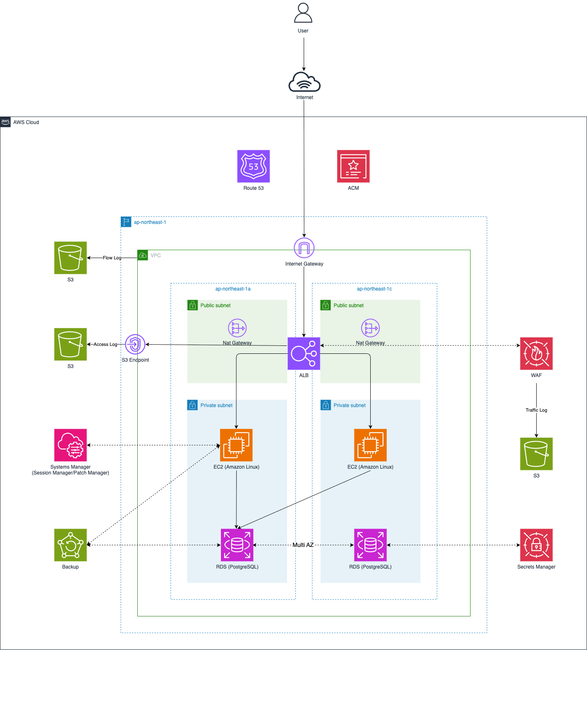

# terraform-monolith-template

## 概要

このリポジトリには、モノリシックアーキテクチャ用のTerraformテンプレートが含まれています。

&emsp;

## 構成図

&emsp;

## 要件

- [AWS CLI](https://aws.amazon.com/cli) - v2以降
- [Terraform](https://www.terraform.io/downloads.html) - v1以降

&emsp;
